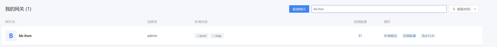
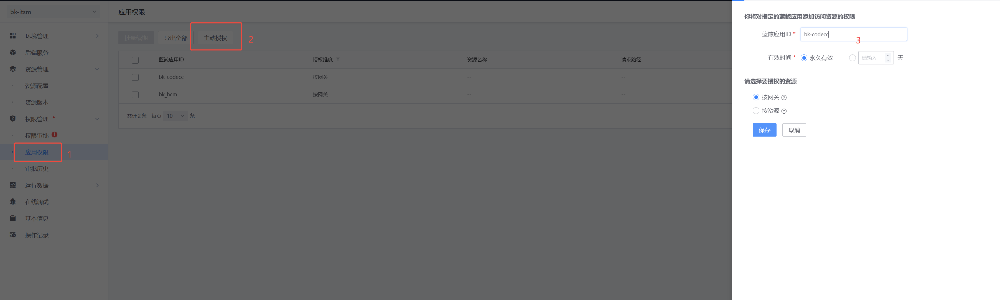
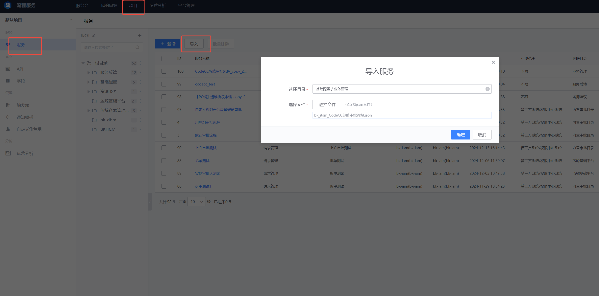

## 忽略审批功能使用前配置
忽略审批功能使用前需要配置好以下资源：
1. 创建蓝鲸APPCODE （蓝鲸部署默认创建）
2. 申请ITSM接口权限
3. 申请虚拟账号
4. 创建ITSM项目与流程

### 1.申请ITSM接口权限
- 进入蓝鲸的环境的APIGW，如 http://apigw.sample.com/, 搜索 ```bk-itsm```
  

- 进入网关后，对bk-codecc进行网关授权
  

### 2.创建ITSM项目与流程
- 进入蓝鲸流程服务，如 http://apps.sample.com/bk--itsm/#/ 导入流程 [0001_bk_codecc_20250423_itsm.json](../../support-files/codecc/bkitsm/0001_bk_codecc_20250423_itsm.json)
  

### 3.申请虚拟账号（codecc_public）
* 权限中心该功能计划于25年中旬开源， 暂时传admin


### 4.数据库数据添加
数据库db_task, 集合名称：t_itsm_system_info
注意修改以下配置：
1. https://bk-itsm.sample.com itsm host
2. http://codecc.sample.com codec host
3. create_ticket_body 中的 service_id 当前是100
```
{
    "_id" : ObjectId("67486b238aa6b6375661a4a9"),
    "system" : "BK_ITSM",
    "name_cn" : "BK_ITSM",
    "create_ticket_url" : "https://bk-itsm.sample.com/prod/v2/itsm/create_ticket",
    "create_ticket_body" : "{\"bk_app_secret\": \"{bk_app_secret}\",\"bk_app_code\": \"{bk_app_code}\",\"service_id\": 100,\"creator\": \"{creator}\",\"fields\": [{\"key\": \"title\",\"value\": \"CodeCC忽略问题审批\"},{\"key\": \"project_id\",\"value\": \"{project_id}\"},{\"key\": \"dimension\",\"value\": \"{dimensions}\",\"choice\": [{\"key\": \"STANDARD\",\"name\": \"代码规范\"},{\"key\": \"SECURITY\",\"name\": \"安全漏洞\"},{\"key\": \"DEFECT\",\"name\": \"代码缺陷\"}]},{\"key\": \"severities\",\"value\": \"{severities}\",\"choice\": [{\"key\": \"1\",\"name\": \"严重\"},{\"key\": \"2\",\"name\": \"一般\"},{\"key\": \"4\",\"name\": \"提示\"}]},{\"key\": \"ignore_reason_type\",\"value\": \"{ignore_reason_type}\"},{\"key\": \"ignore_reason\",\"value\": \"{ignore_reason}\"},{\"key\": \"ignore_count\",\"value\": \"{ignore_count}\"},{\"key\": \"defect_detail_url\",\"value\": \"{defect_detail_url}\"},{\"key\": \"approver_type\",\"value\": \"{approver_type}\",\"choice\": [{\"key\": \"PROJECT_MANAGER\",\"name\": \"项目管理员\"},{\"key\": \"TASK_MANAGER\",\"name\": \"任务管理员\"},{\"key\": \"CHECKER_PUBLISHER\",\"name\": \"规则发布者\"},{\"key\": \"IGNORE_AUTHOR_LEADER\",\"name\": \"忽略人直属Leader\"},{\"key\": \"BG_SECURITY_MANAGER\",\"name\": \"BG安全负责人\"},{\"key\": \"CUSTOM_APPROVER\",\"name\": \"自定义\"}]},{\"key\": \"approvers\",\"value\": \"{approvers}\"}],\"fast_approval\": false,\"meta\": {\"callback_url\": \"http://codecc.sample.com/defect/api/external/approval/callback?approvalId={approval_id}&x-devops-project-id={project_id}\"}}",
    "get_ticket_status_body" : "{\"bk_app_secret\":\"{bk_app_secret}\",\"bk_app_code\":\"{bk_app_code}\",\"sn\":{sn},\"bk_username\":\"{bk_username}\",\"access_token\":\"{access_token}\"}",
    "get_ticket_status_url" : "https://bk-itsm.sample.com/prod/v2/itsm/ticket_approval_result",
    "operate_ticket_body" : "{\"bk_app_secret\":\"{bk_app_secret}\",\"bk_app_code\":\"{bk_app_code}\",\"sn\":\"{sn}\",\"operator\":\"{operator}\",\"action_type\":\"{action_type}\",\"action_message\":\"{action_message}\",\"bk_username\":\"{bk_username}\",\"access_token\":\"{access_token}\"}",
    "operate_ticket_url" : "https://bk-itsm.sample.woa.com/prod/v2/itsm/operate_ticket"
}
```
### 4.Helmfile 添加服务启动配置
```
  bkCodeccItsmAppCode: bk_codecc
  bkCodeccItsmAppSecret: {{ .Values.appSecret.bk_codecc }}
  bkCodeccItsmUsername: admin
```


