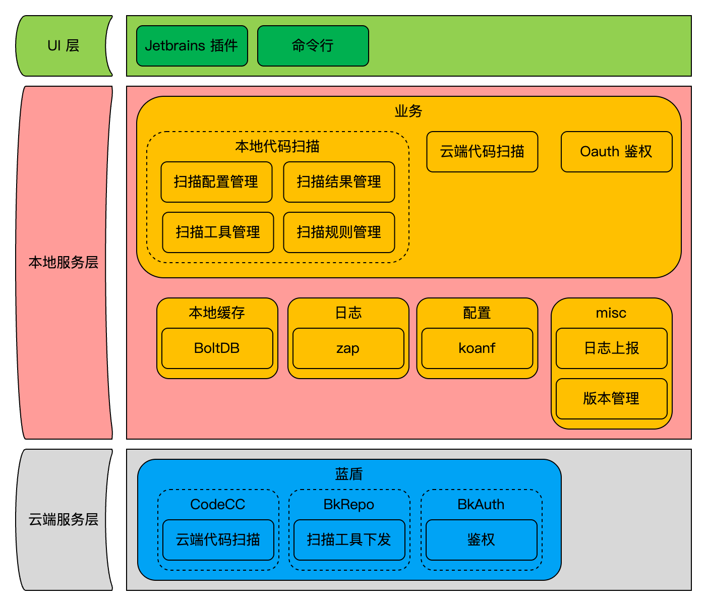

# PreCI 构建部署文档

根据本文档，可完成以下步骤：
- 在云端搭建 **蓝盾平台**
- 在开发机上安装 **PreCI Local Server**
- 在开发机上安装 **JetBrains PreCI 插件**

其中：
- **蓝盾平台** 提供认证、项目与云端能力的前置依赖
- **PreCI Local Server** 负责本地扫描、规则集管理、结果查询与云端服务调用
- **PreCI JetBrains IDE 插件** 负责在 JetBrains 系 IDE 中拉起本地服务、触发扫描并展示结果

## 🧭 整体架构


## 🧱 构建部署流程

### 1. 部署蓝盾平台

参考官方部署文档：

- [蓝盾 CI 套件部署文档](https://bk.tencent.com/docs/markdown/ZH/DeploymentGuides/7.2/install-ci-suite.md)

请确保部署后的蓝盾平台可提供以下服务：

- **BKAuth**：提供 OAuth 认证服务
- **CodeCC**：提供云端代码检查服务（访问地址记为 `CodeCCBaseUrl`）
- **制品仓库（BkRepo）**：制品下载（访问地址记为 `BkRepoBaseUrl`）
- **项目模块**：创建蓝盾项目

### 2. 安装 PreCI
有两种安装方式可供选择：

#### 2.1. 下载安装
直接下载现成的安装包进行安装。
- 下载链接：[Server](), [Plugin]()
- 在链接中根据本机环境选择相应的脚本或安装包进行安装即可

#### 2.2. 源码编译安装
如有定制化需求，可以基于源码做改动后，自行编译出版本来使用。

编译前请先准备以下环境：

- **PreCI Local Server**
  - Go：1.25.1+
  - Make
- **JetBrains IDE 插件**
  - JDK：17
  - JetBrains IDE：2023.2+（如 IntelliJ IDEA、GoLand、PyCharm、WebStorm、Android Studio 等）

编译命令如下：

- **PreCI Server**
```shell
# 根据本机环境选择相应的 make build 命令
# windows
make build-win
# linux
make build-linux
# mac-amd64
make build-mac-amd64
# mac-arm64
make build-mac-arm64

make copy-config
```
构建产物位于 `bin/` 目录。

完成构建后，可使用安装脚本将构建产物安装到本机。请确保安装脚本与编译产物位于同一目录下，然后再执行。
> Windows 环境使用 /script/win/install.ps1 \
> Unix 环境使用 /script/unix/install.sh

- **PreCI Plugin**
```shell
./gradlew buildPlugin

# 如需指定版本号
./gradlew buildPlugin -PpluginVersion=1.2.0
```
构建包位于 `build/distributions/preci-[version].zip`，可直接将其安装到 Jetbrains IDE：
> 打开 Jetbrains IDE → **Settings** → **Plugins** → ⚙️ → **Install Plugin from Disk...** \
> 选择构建包完成安装

### 3. PreCI Server 配置

启动 PreCI Server 前，还需要根据 `1. 部署蓝盾平台` 的 CodeCCBaseUrl、BkRepoBaseUrl 和蓝盾项目 ID 修改 config 目录下的配置。默认配置如下：

```jsonc 
// initConfig.json
{
  "Web": {
    "ReadTimeout": "5s",
    "WriteTimeout": "15m",
    "IdleTimeout": "120s",
    "ShutdownTimeout": "20s",
    "CodeCCBaseUrl": "http://codecc.com"
  },
  "BkRepo": {
    "BaseUrl": "http://bkrepo.com",
    "Project": "bkdevops",
    "Repo": "static",
    "DownloadFolder": "http://bkrepo.com/generic/bkdevops/static/preci/v2/[ENV]",
    "UploadSubPath": "gw/resource/preci/v2/log"
  },
  "Log": {
    "Level": "info"
  },
  "Db": {
    "Timeout": "3s",
    "InitialMmapSize": "33554432"
  },
  "Task": {
    "MaxIncrementalFileSize": 1000
  }
}
```

```jsonc
// authConfig.json
{
  "BKAuth": {
    "BaseURL": "http://bkauth.com/realms/bk-devops",
    "ClientID": "bk-preci",
    "Resource": "service:codecc"
  }
}
```

### 4. 安装验证
如能正常启动 PreCI 服务即代表安装成功：

```shell
% preci server start
2026/04/21 20:48:47 install dir: /Users/xxx/PreCI
2026/04/21 20:48:47 [>]START starting preci server...
2026/04/21 20:48:47 preci server PID: 33826
2026/04/21 20:48:47 [+]SUCCESS preci server started successfully, PID: 33826, Port: 50422
2026/04/21 20:48:48 [+]SUCCESS token 有效。 userId: xxx, projectId: xxx

% preci
2026/04/21 20:50:00 port: 50422, install dir: /Users/xxx/PreCI
PreCI CLI v2 是一个本地化代码质量检查命令行工具。

通过与本地 PreCI Server 协作，提供高效的静态代码扫描服务，帮助开发者在编码阶段
快速识别代码潜在缺陷和安全问题。
......
```

## 📖 使用指南

完成上述部署后，可参考以下文档，了解 PreCI 详细的使用方法、功能说明和操作示例：

- **PreCI CLI 使用说明**：[Server README.md](preci_server/README.md)
- **PreCI JetBrains 插件使用说明**：[Plugin README.md](https://git.woa.com/devops-backend/ide-plugin/blob/v2_community/README.md)
