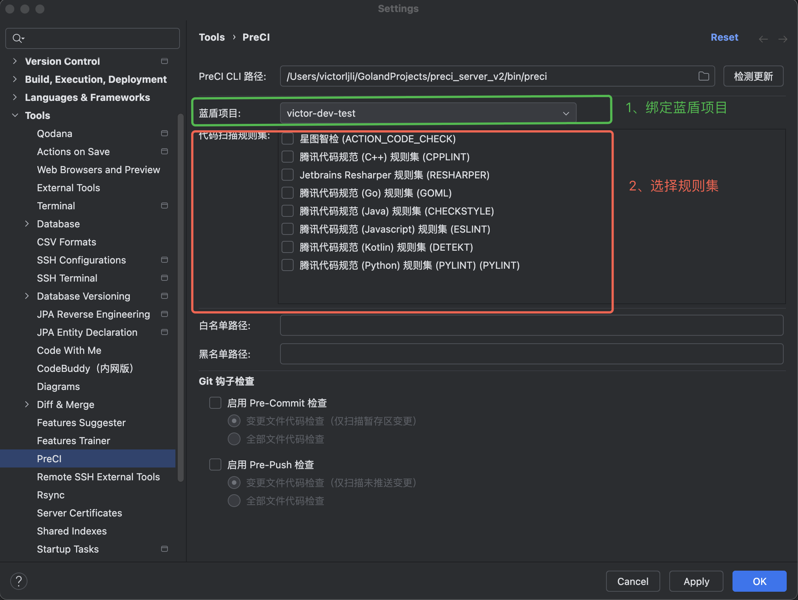
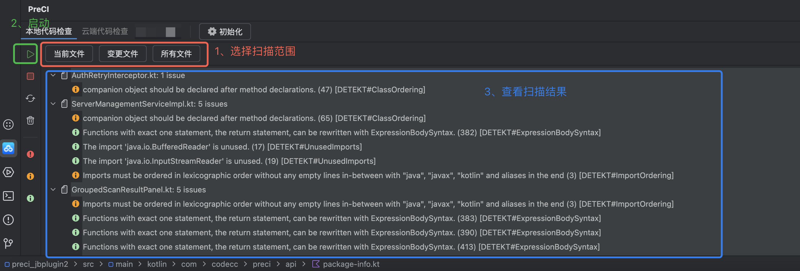

# PreCI — Jetbrains IDE 代码质量检查插件

**PreCI** 是一个 JetBrains IDE 插件，帮助开发者在本地 IDE 中快速发现代码质量问题。插件与 PreCI Local Server 通信，支持多种扫描模式和实时结果展示。

## 主要功能

- **多种扫描模式**：全量扫描、目标扫描（右键选中文件/目录）、增量扫描（pre-commit / pre-push）
- **实时结果展示**：在 IDE 编辑器中直接高亮显示问题，一键跳转到问题代码位置
- **规则集管理**：灵活选择和配置代码检查规则集
- **服务管理**：便捷地启动、停止和监控 PreCI Local Server
- **VCS 集成**：支持 Git pre-commit 和 pre-push 检查
- **OAuth 鉴权**：通过 BKAuth OAuth 进行用户认证
- **自动更新**：及时获取最新版本和功能

## 构建及安装
详见 [PreCI 构建部署文档](https://git.woa.com/codecc/preci_server/blob/v2_community/PreCI%20%E6%9E%84%E5%BB%BA%E9%83%A8%E7%BD%B2%E6%96%87%E6%A1%A3.md)

## 使用步骤
1. **绑定蓝盾项目**：通过 Settings（`Settings... -> Tools -> PreCI`）绑定项目
2. **配置规则集**：通过 Settings 管理检查规则

3. **初始化项目**
4. **执行扫描**
5. **查看结果**

