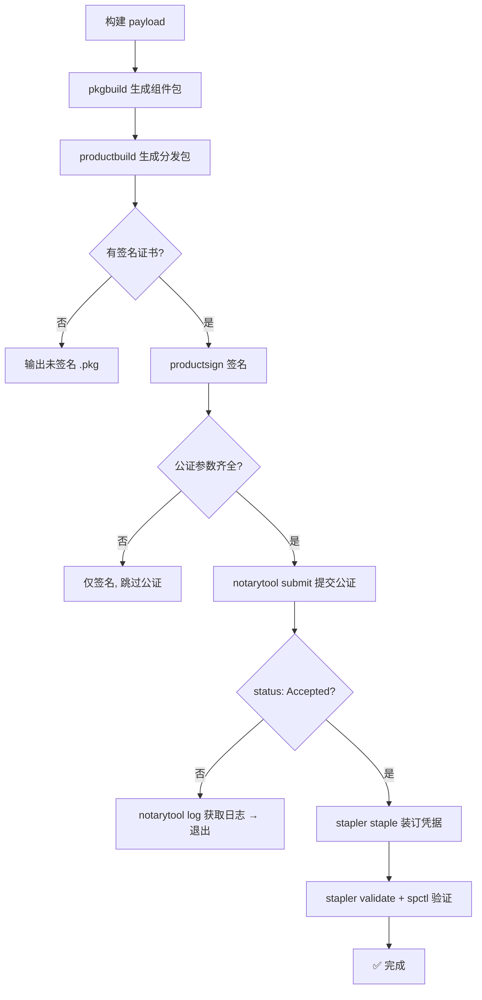

# macOS PKG 安装器签名与公证 — 实现注意点与关键代码

## 📋 整体流程



---

## 🔑 注意点一：证书类型必须正确

| 证书类型 | 用途 | 能否公证 |
|---------|------|---------|
| `Developer ID Installer` | **非 App Store 分发（网络下载）** | ✅ 支持 |
| `3rd Party Mac Developer Installer` | Mac App Store 分发 | ❌ 不支持 |
| `Developer ID Application` | 签名内部二进制文件 | 不直接用于 pkg |

> ⚠️ **这是最容易踩的坑**。如果用 `3rd Party Mac Developer Installer` 签名后提交公证，Apple 会返回 `status: Invalid`，错误信息为 *"The binary is not signed with a valid Developer ID certificate"*。

**关键代码（签名）：**

```bash
# 必须使用 "Developer ID Installer" 开头的证书
productsign \
    --sign "${SIGNING_IDENTITY}" \
    "${BUILD_DIR}/PreCI-unsigned.pkg" \
    "${OUTPUT_FILE}"
```

查看当前机器已安装的证书：

```bash
security find-identity -v | grep "Developer ID"
```

---

## 🔑 注意点二：公证需要三个额外参数

除了签名证书，公证还需要：

- **APPLE_ID** — Apple 开发者账号邮箱
- **APP_PASSWORD** — App 专用密码（在 [appleid.apple.com](https://appleid.apple.com) 生成，**不是账号密码**）
- **TEAM_ID** — 开发者团队 ID

**关键代码（提交公证）：**

```bash
xcrun notarytool submit "${OUTPUT_FILE}" \
    --apple-id "${APPLE_ID}" \
    --password "${APP_PASSWORD}" \
    --team-id "${TEAM_ID}" \
    --wait 2>&1 | tee "${NOTARY_LOG}" || true
```

> `--wait` 让命令同步等待 Apple 处理完成（通常 2~5 分钟），避免需要轮询。

---

## 🔑 注意点三：公证结果必须检查后再装订

公证可能返回 `status: Invalid`，必须**先检查成功再执行 `stapler staple`**，否则装订会失败报错。

**关键代码（结果检查）：**

```bash
if grep -q "status: Accepted" "${NOTARY_LOG}"; then
    info "Notarization accepted."
else
    error "Notarization failed!"
    # 拉取 Apple 详细审查日志
    xcrun notarytool log "${SUBMISSION_ID}" \
        --apple-id "${APPLE_ID}" \
        --password "${APP_PASSWORD}" \
        --team-id "${TEAM_ID}" 2>&1 || true
    exit 1
fi
```

---

## 🔑 注意点四：日志输出用 `tee` 避免顺序错乱

`notarytool` 的输出较长且包含进度信息，如果用变量捕获（`$(...)`），会导致日志和错误信息的打印顺序混乱。应使用 `tee` 实时输出到控制台并同时保存到文件：

```bash
xcrun notarytool submit ... 2>&1 | tee "${NOTARY_LOG}" || true
# 之后从文件中 grep 检查结果
```

---

## 🔑 注意点五：装订（Staple）让离线验证成为可能

公证成功后，`stapler staple` 将公证凭据嵌入 `.pkg` 文件本身，这样用户在**没有网络连接**的情况下 Gatekeeper 也能验证通过。

**关键代码（装订 + 验证）：**

```bash
xcrun stapler staple "${OUTPUT_FILE}"
xcrun stapler validate "${OUTPUT_FILE}"
spctl --assess -v --type install "${OUTPUT_FILE}"
```

---

## 🔑 注意点六：三级降级策略

脚本实现了优雅的降级处理，根据提供的参数自动选择行为：

| 提供的参数 | 行为 | 适用场景 |
|-----------|------|---------|
| `VERSION` + `SIGNING_IDENTITY` + `APPLE_ID` + `APP_PASSWORD` + `TEAM_ID` | 签名 → 公证 → 装订 → 验证（完整流程） | **生产发布** |
| `VERSION` + `SIGNING_IDENTITY` | 仅签名，跳过公证（会有 Gatekeeper 警告） | 内部测试分发 |
| 仅 `VERSION` | 不签名不公证，直接输出 | 本地开发调试 |

**关键代码（降级判断）：**

```bash
if [[ -n "${SIGNING_IDENTITY}" && -n "${APPLE_ID}" && -n "${APP_PASSWORD}" && -n "${TEAM_ID}" ]]; then
    # 完整流程：签名 + 公证 + 装订
elif [[ -n "${SIGNING_IDENTITY}" ]]; then
    # 仅签名，跳过公证
else
    # 不签名，不公证
fi
```

---

## 📝 补充建议

### 1. 内部二进制也需要签名

如果 `.pkg` 内包含的可执行文件（如 `preci`、`preci-server` 等）没有用 `Developer ID Application` 证书 + `--options runtime`（hardened runtime）签名，公证也可能失败：

```bash
codesign --force --options runtime \
    --sign "Developer ID Application: Your Team (XXXXXXXXXX)" \
    PreCI/preci PreCI/preci-server PreCI/preci-mcp PreCI/preci-updater
```

### 2. CI/CD 中推荐用 Keychain Profile 管理凭据

比直接传密码更安全：

```bash
# 一次性配置（在构建机器上执行）
xcrun notarytool store-credentials "PRECI_NOTARY" \
    --apple-id ... --team-id ... --password ...

# 构建时使用 profile 名称代替明文密码
xcrun notarytool submit ... --keychain-profile "PRECI_NOTARY" --wait
```

### 3. 确认构建机器证书

```bash
security find-identity -v | grep "Developer ID"
```
